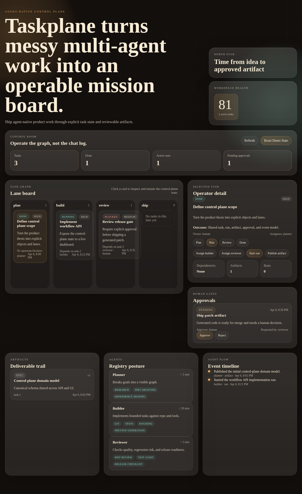

# Taskplane

Taskplane is an agent-native task control plane for teams that need humans, multiple agents, tools, artifacts, and approvals to work against the same explicit state.



It is deliberately not chat-first. The product is organized around:

- Tasks as the primary object
- Artifacts as versioned outputs
- Approvals as explicit gates
- Runs as accountable execution traces
- Events as the audit log

## Product Thesis

Most agent products treat collaboration as message passing. Taskplane treats collaboration as shared operational state.

That means:

- a planner can decompose work into a visible task graph
- specialist agents can own bounded runs
- humans can review artifacts and unblock approvals
- every important action lands in an event timeline

## What It Does

- Renders work as a visible lane board instead of a hidden conversation.
- Tracks tasks, runs, approvals, artifacts, and audit events in one snapshot.
- Lets operators mutate task state directly from the dashboard.
- Keeps the demo portable with a resettable JSON-backed workspace.

## Why This Shape

The point is not to build another agent SDK. The point is to make autonomous work reviewable, governable, and operable:

- a planner can produce a task graph
- a builder can execute against a bounded task
- a reviewer can stop or approve delivery
- a human can intervene exactly where it matters

## Repo Layout

- `apps/api`: control-plane API and demo persistence
- `apps/web`: operator dashboard and workflow surface
- `packages/core`: shared domain model and seed helpers
- `docs`: architecture and open-source roadmap

## Local Development

```bash
npm run dev
```

This starts a zero-dependency local control plane:

- API and web shell at `http://localhost:8787`

## Verification

```bash
npm test
```

## What Exists Today

- shared domain model for tasks, runs, approvals, artifacts, and events
- a file-backed control-plane API with mutation routes and resettable demo data
- a local web shell served directly from the Node runtime
- a product framing that keeps the implementation aligned with the thesis

## API Surface

The demo control plane persists state in `data/demo-workspace.json`.

- `GET /api/workspace`
- `POST /api/workspace/reset`
- `POST /api/tasks/:taskId/status`
- `POST /api/tasks/:taskId/assignments`
- `POST /api/approvals/:approvalId/decision`
- `POST /api/artifacts`
- `POST /api/runs`

## Example Flows

```bash
curl http://127.0.0.1:8787/api/workspace
curl -X POST http://127.0.0.1:8787/api/tasks/task-3/status \
  -H 'content-type: application/json' \
  -d '{"status":"in_review","actor":"planner"}'
curl -X POST http://127.0.0.1:8787/api/workspace/reset
```

## Roadmap

- richer graph visualization and dependency editing
- real multi-user state with durable backing storage
- policy-aware approvals and release gates
- repo and artifact adapters beyond the demo snapshot
